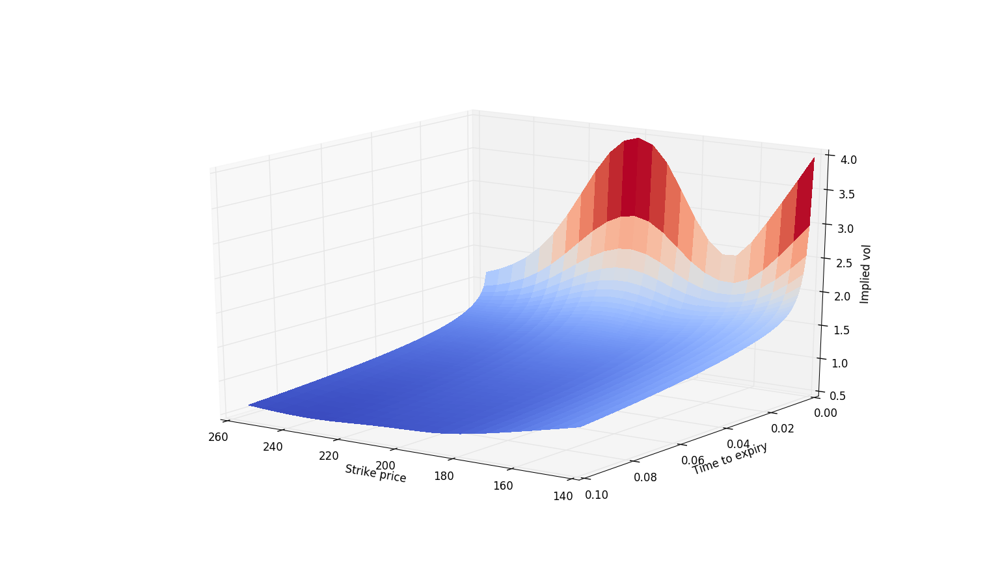
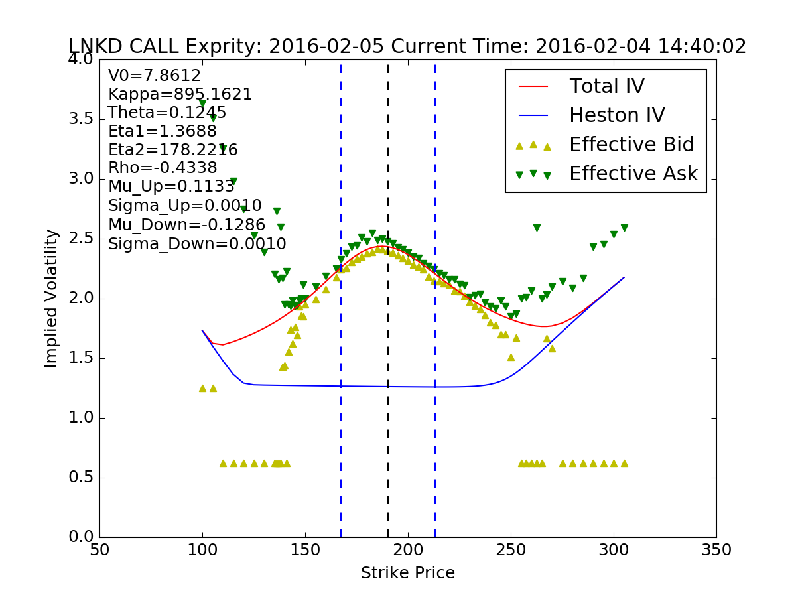

# Heston Model Pricing Library[](https://github.com/sindresorhus/awesome)


_Author: Junyan Xu_  
_Date:   Dec 17th, 2016_  


## 1. Module Introduction

Before the discrete events happen, there are usually some abnormalities on the theoretically "convex" vol surface. Very often at the ATM part we will see some small bumps. This package provide you a simple way to use combination of Heston and jump model to calibrate these exotic shape.

The library is designed for providing fast C++ implementation of Heston model pricer for Python. You can download the library to easily compute all kinds of Heston model variation. Currently the package support the pricing of:
* Normal B-S model option
* Heston model
* Heston model with Gaussian jumps(for vol surface calibration before discrete event)
* Two-regime Heston model with Gaussian jumps
The $\alpha$ in the formula is set to be 1.5 while the integral range is set to be $[-2000, 2000]$. It is recommended that you can choose StepSize to be 0.4.  

## 2. Pricing Module

### Installation
The pricing module is implemented in C++ so it has faster computation speed than directly implementing in Python. To begin with you need to install GNU Scientific Library in your PC. After download latest [GSL](http://ftp://ftp.gnu.org/gnu/gsl/), extract the .tar.gz or .zip into a directory. Now we start to install this C++ library

* cd to the Python-Heston-Option-Pricer directory, type following command into terminal
```
./configure
```

* Then type
```
make
```

* After compliation finished, type
```
make install
```
Now the gsl has been installed into your computer and the headers are in **\usr\local\include** and libraries object files are in **\usr\local\lib**

* Switch to my Python-Heston-Option-Pricer directory. you will see setup.py there, type
```
sudo python setup.py build install
```

### A simple exotic volatility surface example

After installed Option module to your python. Open up your ipython console to try:
```python
import PyHeston
import numpy
import matplotlib.pyplot as plt
import itertools
from mpl_toolkits.mplot3d import Axes3D
from matplotlib import cm
help(PyHeston.HestonMixedGaussianCall)
```


    Help on built-in function HestonMixedGaussianCall in module PyHeston:

    HestonMixedGaussianCall(...)
        Calculate heston model mixed gaussian call option price. The parameters follow the following sequence:

         S: Current underlying price
         V0: Current instantaneous volatility square
         K: Strike price
         T: Time to expiry
         r: Interest rate
         Kappa: Mean reversion maganitude
         Theta: Long term mean in Heston model
         Eta: Vol of vol
         Rho: Correlation of underlying stochastic term with vol

         The Mixed Gaussian part has four parameters:
         Up: average maganitude of up log jump
         UpSigma: dispersion maganitude of up log jump
         Down: average maganitude of down log jump
         DownSigma: dispersion maganitude of down log jump
        Stepsize: Numerical solution stepsize. Recommend 0.4

```python
# Background parameters

S = 200
v=0.8
r = 0.1
dividend = 0
Kappa = 1
Theta = 0.4
Eta =15
Rho =-0.5
Up = 0.1
Down = -0.1
UpSigma = 0.02
DownSigma = 0.02
StepSize = 0.4

# Define a wrapper calling computation func

def getHestonMixedGaussianCallIV(K, T):
    return PyHeston.BSCallIV(
        PyHeston.HestonMixedGaussianCall(
            S, v,
            K, T,
            r,
            Kappa, Theta, Eta, Rho,
            Up, UpSigma, Down, DownSigma,
            StepSize
        ),
        S, K, T, dividend, 0
    )


getHestonMixedGaussianCallIV(200, 1)
Strikes = numpy.arange(140, 260, 5)
T = numpy.arange(0.001, 0.1, 0.001)
Strikes, T = numpy.meshgrid(Strikes, T)
IVsurface = numpy.zeros(Strikes.shape)
for i in range(Strikes.shape[0]):
    for j in range(Strikes.shape[1]):
        IVsurface[i][j] = getHestonMixedGaussianCallIV(
            Strikes[i][j], T[i][j]
        )
fig = plt.figure()
ax = fig.add_subplot(111, projection='3d')
surf = ax.plot_surface(
    Strikes, T, IVsurface, rstride=1, cstride=1,
    cmap=cm.coolwarm, linewidth=0, antialiased=False)
ax.set_xlabel('Strike price')
ax.set_ylabel('Time to expiry')
ax.set_zlabel('Implied vol')
plt.show()
```


### Function List

The interface of all functions in **Option** module are listed here:
```python
from PyHeston import *
BSCall(S, K, T, Sigma, d, r)
BSPut(S, K, T, Sigma, d, r)
BSCallIV(C, S, K, T, d, r)
BSPutIV(P, S, K, T, d, r)
HestonModelCall(S, V0, K, T, r, Kappa, Theta, Ita, Rho, StepSize)
HestonModelPut(S, V0, K, T, r, Kappa, Theta, Ita, Rho, StepSize)
HestonMixedGaussianCall(S, V0, K, T, r, Kappa, Theta, Eta, Rho, Up, UpSigma, Down, DownSigma, StepSize)
HestonMixedGaussianPut(S, V0, K, T, r, Kappa, Theta, Eta, Rho, Up, UpSigma, Down, DownSigma, StepSize)
TwoRegimeHestonModelCall(S, V0, K, T1, T2, r, Kappa1, Theta1, Eta1, Rho1, Kappa2, Theta2, Eta2, Rho2, StepSize)
TwoRegimeHestonModelPut(S, V0, K, T1, T2, r, Kappa1, Theta1, Eta1, Rho1, Kappa, Theta2, Eta2, Rho2, StepSize)
TwoRegimeHestonModelCall(S, V0, K, T1, T2, r, Kappa1, Theta1, Eta1, Rho1, Kappa2, Theta2, Eta2, Rho2, StepSize)
TwoRegimeHestonModelPut(S, V0, K, T1, T2, r, Kappa1, Theta1, Eta1, Rho1, Kappa2, Theta2, Eta2, Rho2, StepSize)
```

### Other Example of Calibration


