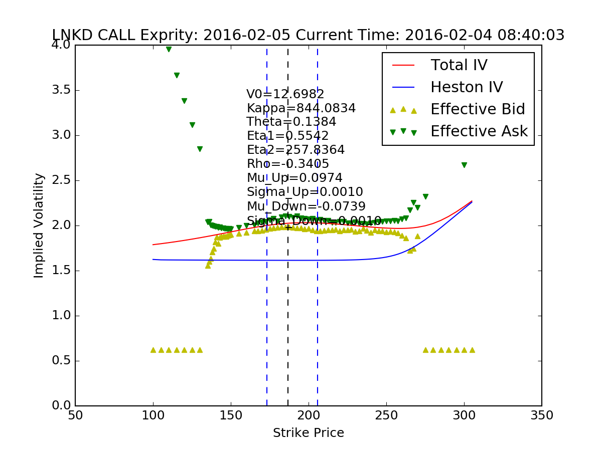

Author: Junyan Xu  
Date:   Dec 1st, 2016  

# Heston Model Pricing Library


## 1. Module Introduction

The library is designed for providing fast C++ implementation of Heston model pricer. You can download the library to easily compute all kinds of Heston model variaties. Currently the package support the pricing of:
    1. Normal B-S model option
    2. Heston model
    3. Heston model with Gaussian jumps(for vol surface calibration before discrete event)
    4. Two-regime Heston model with Gaussian jumps
The $\alpha$ in the formula is set to be 1.5 while the integral range is set to be $[-2000, 2000]$. It is recommended that you can choose StepSize to be 0.4.  

## 2. Pricing Module

### Installation
The pricing module is implemented in C++ so it has faster computation speed than directly implementing in Python. To begin with you need to install GNU Scientific Library in your PC. After download latest [GSL](http://ftp://ftp.gnu.org/gnu/gsl/), extract the .tar.gz or .zip into a directory. Now we start to install this C++ library
    1. cd to the directory, type following command into terminal
```
./configure
```
    2. The type 
```
make
```
    3. After compliation finished, type
```
make install
```
Now the gsl has been installed into your computer and the headers are in **\usr\local\include** and libraries object files are in **\usr\local\lib**

    4. Switch to my Option directory. you will see setup.py there, type
```
sudo python setup.py build install
```

### Useage

After installed Option module to your python. Open up your ipython console to try:
```python
import Option
S = 100
V0 = 0.09
K = 100
T = 1
r = 0
Kappa = 1
Theta = 0.09
Eta = 1
Rho = 1
Up = 0.1
UpSigma = 0.1
Down = -0.1
DownSigma = 0.1
StepSize = 0.4
print(Option.HestonMixedGaussianCall(
        S, V0, K, T, r, Kappa, Theta, Eta, Rho, Up, UpSigma, Down, DownSigma, StepSize))
```

### Function List

The interface of all functions in **Option** module are listed here:
```python
from Option import *
BSCall(S, K, T, Sigma, d, r)
BSPut(S, K, T, Sigma, d, r)
BSCallIV(C, S, K, T, d, r)
BSPutIV(P, S, K, T, d, r)
HestonModelCall(S, V0, K, T, r, Kappa, Theta, Ita, Rho, StepSize)
HestonModelPut(S, V0, K, T, r, Kappa, Theta, Ita, Rho, StepSize)
HestonMixedGaussianCall(S, V0, K, T, r, Kappa, Theta, Eta, Rho, Up, UpSigma, Down, DownSigma, StepSize)
HestonMixedGaussianPut(S, V0, K, T, r, Kappa, Theta, Eta, Rho, Up, UpSigma, Down, DownSigma, StepSize)
TwoRegimeHestonModelCall(S, V0, K, T1, T2, r, Kappa1, Theta1, Eta1, Rho1, Kappa2, Theta2, Eta2, Rho2, StepSize)
TwoRegimeHestonModelPut(S, V0, K, T1, T2, r, Kappa1, Theta1, Eta1, Rho1, Kappa, Theta2, Eta2, Rho2, StepSize)
TwoRegimeHestonModelCall(S, V0, K, T1, T2, r, Kappa1, Theta1, Eta1, Rho1, Kappa2, Theta2, Eta2, Rho2, StepSize)
TwoRegimeHestonModelPut(S, V0, K, T1, T2, r, Kappa1, Theta1, Eta1, Rho1, Kappa2, Theta2, Eta2, Rho2, StepSize)
```

### Example of Calibration

